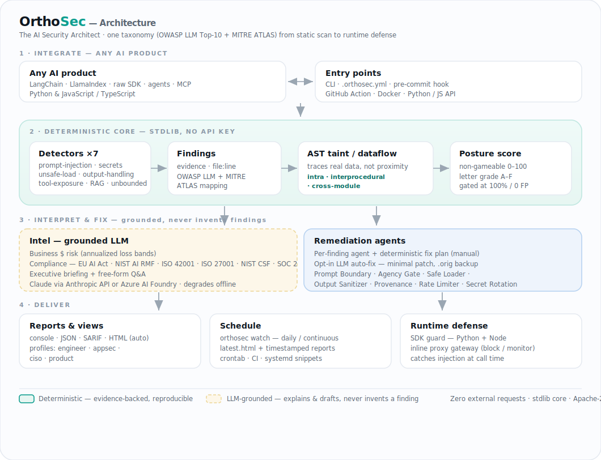

<h1 align="center">OrthoSec</h1>
<p align="center"><b>The AI Security Architect</b><br>
Technical AI-risk analysis with executive business context. Open source.</p>

<p align="center">
  <a href="https://pypi.org/project/orthosec/"></a>
  
  
  <a href="LICENSE"></a>
</p>
<!-- CI badge + live-demo link re-added once the org GitHub Actions billing lock is cleared:
  <a href="https://github.com/cloudivian-org/OrthoSec/actions/workflows/ci.yml"></a>
-->

---

OrthoSec scans any AI product and answers two questions at once:

- **For engineers** — *where is this AI system exposed, and how do I fix it?* Deterministic detectors map every finding to the OWASP LLM Top-10 and MITRE ATLAS, with `file:line` evidence and concrete remediation.
- **For executives** — *are we exposed, how bad is the blast radius, and what's the regulatory fallout?* A grounded intel layer translates findings into business risk, a posture score, and compliance mapping (EU AI Act, NIST AI RMF, ISO 42001, SOC 2).

One tool. Technical rigor **and** business impact.

## Why OrthoSec

AI products fail in AI-specific ways — prompt injection, excessive agency, model supply-chain compromise, data leakage — that classic AppSec tools don't see. OrthoSec is purpose-built for that surface, and it speaks to both the engineer shipping the agent and the leader accountable for the risk.

**Trust by design:** detectors are deterministic and evidence-backed. The LLM layer only *explains* findings — it never invents them. So the security facts are always defensible.

## Quick start

Zero dependencies. Install, or clone and run:

```bash
pip install orthosec                     # + extras: orthosec[intel,ts,js,pretty]
orthosec scan ./path/to/your/ai-app

# from source (no install):
git clone https://github.com/cloudivian-org/OrthoSec && cd OrthoSec
python -m orthosec.cli scan ./path/to/your/ai-app
```

Try it on the bundled vulnerable demo:

```bash
python -m orthosec.cli scan examples/vulnerable-agent
```

```
  Posture score: 47/100   Grade:  D
  2 critical   2 high

  [CRITICAL] Model-invokable tool with shell/command execution and no confirmation gate
      agent.py:25
      OWASP LLM06 (Excessive Agency)  ·  ATLAS AML.T0053
      business: Agent takes real-world actions attacker directs — financial/operational loss.
      fix: Scope the tool to the minimum capability, add an allowlist, and gate
           irreversible/high-impact actions behind human confirmation.
```

## Audience profiles — one scan, four lenses

The same findings, reframed for whoever is reading. `--profile` controls what the report shows, the severity floor, and how the executive briefing is written.

```bash
python -m orthosec.cli scan ./my-ai-app --profile engineer   # default: every issue + fix
python -m orthosec.cli scan ./my-ai-app --profile appsec     # attack paths, ATLAS, CI gates
python -m orthosec.cli scan ./my-ai-app --profile ciso       # posture, $risk, compliance — no line noise
python -m orthosec.cli scan ./my-ai-app --profile product    # must-fix-before-ship vs. fast-follow
```

| Profile | Audience | Emphasis |
|---|---|---|
| `engineer` | AI/ML Engineer | Evidence + remediation on every finding |
| `appsec` | Security / AppSec Engineer | Attack path, MITRE ATLAS, what to gate in CI |
| `ciso` | CISO / Security Leader | Posture, dollar risk, regulatory exposure |
| `product` | AI Product / Eng Leader | Risk vs. ship velocity, quick wins |

`python -m orthosec.cli profiles` lists them.

## The executive layer

The core scan runs offline. Add the intel layer for board-ready narrative + free-form Q&A:

```bash
pip install -e ".[intel]"
cp .env.example .env      # then put your key in .env

python -m orthosec.cli scan ./my-ai-app --profile ciso
python -m orthosec.cli ask  ./my-ai-app "What's our EU AI Act exposure and what would fix it fastest?"
```

**Configuration (`.env`)** — copy `.env.example` to `.env`. Real environment variables always win over the file.

- **Anthropic API** — set `ANTHROPIC_API_KEY`. Model defaults to `claude-opus-4-8` (`ORTHOSEC_MODEL` overrides).
- **Azure AI Foundry** (Claude via the Anthropic Messages API) — set `AZURE_API_KEY`, `AZURE_BASE_URL`, and `AZURE_MODELS` (e.g. `claude-sonnet-4-6`). OrthoSec auto-selects the Azure backend when these are present.

The intel layer is provider-agnostic and degrades to a deterministic briefing (posture, $risk, compliance) when no key is set — the core product never depends on it.

## Docker

```bash
docker build -t orthosec .
docker run --rm -v "$PWD:/scan" orthosec scan /scan --profile ciso
# with the exec layer:
docker run --rm --env-file .env -v "$PWD:/scan" orthosec scan /scan --profile ciso
```

## Visual report

```bash
python -m orthosec.cli scan ./my-ai-app --html report.html
```

**Every `orthosec scan` writes this report automatically** to `orthosec-report.html` (override with `--html PATH`, disable with `--no-report`). A self-contained, theme-aware HTML report (no external requests) with a **built-in profile toggle** — the same file switches between the engineer / appsec / ciso / product views live. The executive briefing renders as formatted HTML (headings, tables, lists), each finding shows its remediation agent, and selecting findings builds a ready-to-run `orthosec remediate` command. A stacked severity bar and an OWASP LLM Top-10 coverage strip summarize posture at a glance, each dataflow finding shows its **taint path** (`source → sink`) and a **confidence** level, and a Print / Save-as-PDF button exports it. Open it in a browser, attach it to a ticket, or drop it in a board deck.

<!-- Live sample report goes live once the GitHub Pages workflow can run (org Actions billing):
**[▶ View a live sample report →](https://cloudivian-org.github.io/OrthoSec/)** -->
Generate the report locally: `orthosec scan examples/vulnerable-agent` opens `orthosec-report.html`.

## Scheduling — continuous & daily reports

Run OrthoSec on a cadence. Defaults come from `.env` (or the flags override them):

```bash
orthosec watch ./my-ai-app --every 1d            # re-scan daily, write a report each run
orthosec watch ./my-ai-app --every 6h            # every 6h; latest.html always current
orthosec schedule ./my-ai-app --cron "0 9 * * *" # print crontab / GitHub Actions / systemd snippets
```

`watch` writes `report-<timestamp>.html` + `latest.html`/`latest.json` into `--report-dir` (default `orthosec-reports/`) on each run — a daily report if `--every 1d`, continuous if shorter. `.env` keys: `ORTHOSEC_WATCH_EVERY`, `ORTHOSEC_REPORT_DIR`, `ORTHOSEC_CRON`, `ORTHOSEC_PROFILE`. CLI flags always win over `.env`.

## Remediation agents

Every finding is routed to a specialized **remediation agent** that owns a deterministic, reviewable fix plan. Fixes are **manual by default** and **auto is opt-in**:

```bash
python -m orthosec.cli remediate ./my-ai-app                       # print plans (manual)
python -m orthosec.cli remediate ./my-ai-app --rule ORTHO-AGENCY-001 --suggest   # draft a patch, write nothing
python -m orthosec.cli remediate ./my-ai-app --rule ORTHO-SUPPLY-001 --auto      # apply the patch (.orig backup)
```

| Agent | Fixes | Auto? |
|---|---|---|
| Prompt Boundary | prompt-injection surface (LLM01) | ✅ |
| Agency Gate | over-privileged tools (LLM06) | ✅ |
| Safe Loader | unsafe deserialization (LLM03) | ✅ |
| Output Sanitizer | improper output handling (LLM05) | ✅ |
| Provenance | untrusted RAG ingestion (LLM08) | manual |
| Secret Rotation | committed credentials (LLM02) | manual |

For well-understood cases (`torch.load` → `weights_only=True`, `yaml.load` → `yaml.safe_load`) auto-fix applies a **deterministic, LLM-free** one-line edit — no API key, fully reproducible. Everything else falls back to an intel-layer-drafted patch. Either way OrthoSec backs up the original to `*.orig`, applies the fix, then **re-scans to verify the finding is resolved** and flags any new finding the patch introduced (`--no-verify` to skip). Rotation and source-trust decisions stay manual by design. Design contract: the deterministic layer decides **what** is wrong and the plan; the LLM only drafts the **patch**, never invents findings.

## Integrate with any AI product

OrthoSec matches behavioral patterns, not a specific framework — so it works on LangChain, LlamaIndex, raw provider SDKs, custom agents, or MCP tools alike. Full contract in **[INTEGRATION.md](INTEGRATION.md)**. Four implemented ways in:

1. **CLI** — `python -m orthosec.cli scan .`
2. **Project config** — drop [`.orthosec.yml`](.orthosec.example.yml) at your repo root (profile, `fail_on`, `exclude`).
3. **Pre-commit hook** *(no CI needed)* — gate every commit locally:
   ```yaml
   # .pre-commit-config.yaml
   - repo: https://github.com/cloudivian-org/OrthoSec
     rev: v0.5.0
     hooks: [{ id: orthosec }]
   ```
4. **Docker (any CI or local)** — `docker run --rm -v "$PWD:/scan" orthosec scan /scan --sarif /scan/orthosec.sarif --fail-on high`.
5. **GitHub Action** — [`.github/workflows/orthosec.yml`](.github/workflows/orthosec.yml); findings post inline on PRs via SARIF. *(Requires GitHub Actions enabled for the org.)*
6. **Python API / runtime guard** — `from orthosec import Scanner, guard`; Node via [`@orthosec/guard`](sdk/js).

```yaml
# .github/workflows/orthosec.yml
- uses: cloudivian-org/OrthoSec@main
  with: { profile: appsec, fail-on: high, sarif-file: orthosec.sarif }
- uses: github/codeql-action/upload-sarif@v3
  with: { sarif_file: orthosec.sarif }
```

Any other CI: `docker run --rm -v "$PWD:/scan" orthosec scan /scan --sarif /scan/orthosec.sarif --fail-on high`.

## What it detects today

| Detector | OWASP LLM | Catches |
|---|---|---|
| `prompt-hardening` | LLM01 / LLM07 | Untrusted input concatenated into prompts; secrets embedded in system prompts |
| `secrets` | LLM02 | Hardcoded provider/model API keys |
| `unsafe-model-load` | LLM03 / LLM04 | pickle / `torch.load` / unsafe deserialization; unpinned model fetches |
| `dependency-audit` | LLM03 | AI/ML deps in `requirements.txt` / `package.json` that are unpinned or installed from an untrusted source (git/URL/alt index) |
| `data-poisoning` | LLM04 | fine-tuning jobs; training on data from untrusted sources |
| `output-handling` | LLM05 | LLM output flowing unsanitized into eval/shell/SQL/HTML sinks |
| `tool-exposure` | LLM06 | Over-privileged agent tools (shell, file, HTTP, SQL) with no confirmation gate |
| `prompt-leakage` | LLM07 | System prompt written to logs / stdout |
| `rag-trust` | LLM08 | Untrusted web/upload content ingested into a retrieval corpus without provenance |
| `misinformation` | LLM09 | Ungrounded model output returned to users in a high-stakes domain (advisory) |
| `unbounded-consumption` | LLM10 | LLM calls with no output cap; unbounded agent loops (denial-of-wallet) |

**Full OWASP LLM Top-10 (2025) coverage** — all ten categories, 11 detectors, benchmark-gated at 100% precision/recall.

Behavior detectors ignore comments and negation (a `# no confirmation` comment is never read as a mitigation) — false-negative avoidance is a first-class concern. Python targets get **AST taint/dataflow** (`orthosec/analysis/`): the three dataflow-shaped detectors trace real data, not line-proximity — untrusted input into a system prompt (LLM01), model output into a sink (LLM05), and dangerous sinks inside model-invokable tools (LLM06) — each firing only when the actual data reaches the actual sink, at any distance, **across function calls (interprocedural)** and **across modules** (import-resolved — all three detectors, including re-export chains), respecting trust-boundary and sanitizer mitigations. Taint tracking is **framework-aware**: it recognizes model output from LangChain / LlamaIndex / OpenAI / Anthropic call shapes (`chain.invoke`, `query_engine.query`, `chat.completions.create`, …) and untrusted input from Flask / FastAPI / Django request objects. **TypeScript / JSX / JS** get real AST analysis with the optional `orthosec[ts]` extra (tree-sitter): `.ts`/`.tsx`/`.jsx` model-output-into-sink (LLM05) and uncapped-completion (LLM10) key on actual call nodes and dataflow — a string or comment mentioning `.innerHTML`/`.create()` no longer fires. `orthosec[js]` (esprima) covers `.js`. **Go** gets AST analysis with `orthosec[go]` (tree-sitter): `.go` model output flowing into `exec.Command` / raw SQL (`db.Query`/`Exec`) / `template.HTML` (LLM05) and uncapped completion requests (LLM10), aware of go-openai / langchaingo / anthropic-sdk-go call shapes and escaping sanitizers. **Java** gets AST analysis with `orthosec[java]` (tree-sitter): `.java` model output flowing into `Runtime.exec`/`ProcessBuilder` (command), JDBC/JPA raw SQL (`executeQuery`/`createQuery`), or a script `eval` (LLM05), aware of Spring AI (`chatClient…call().content()`) and LangChain4j (`model.generate()`) shapes. Without a language extra, non-Python files fall back to regex automatically (no crash).

Detectors are plugins — drop a file in `orthosec/detectors/`, decorate with `@register`, done. See [CONTRIBUTING.md](CONTRIBUTING.md).

## Runtime guard (SDK)

Static scanning finds risk before deploy; the runtime guard catches it at call time — in any Python AI app, any framework. Zero dependencies.

```python
from orthosec import guard, scan_prompt

@guard(mode="block", on_risk=lambda r: log.warning(r.risks))
def call_llm(prompt: str) -> str:
    ...  # your OpenAI / Anthropic / LangChain call

# or inspect directly
if not scan_prompt(user_input).ok:
    reject()
```

`mode="monitor"` reports via `on_risk` and never raises; `mode="block"` raises `PromptInjectionError` on an injection hit before the call. Output is scanned for credential leaks and executable payloads. A runtime tripwire — pair it with the static scanner and least-privilege tools.

**Node / TypeScript** apps get the same guard via [`@orthosec/guard`](sdk/js) (zero deps):

```js
import { guard, scanPrompt } from "@orthosec/guard";
const chat = guard(async (prompt) => client.chat.completions.create(/* ... */),
                   { mode: "block", onRisk: (r) => log.warn(r.risks) });
```

## Runtime gateway (inline proxy)

For defense without touching app code, run OrthoSec as a proxy in front of the model provider and point your base URL at it:

```bash
orthosec proxy --upstream https://api.openai.com --mode block
# then: export OPENAI_BASE_URL=http://127.0.0.1:8100/v1
```

Every request/response flows through inline: injected prompts are refused (`block`) or logged (`monitor`) before reaching the provider, and responses are scanned for credential leaks / executable payloads. Provider-agnostic (OpenAI + Anthropic message shapes), stdlib-only, adds `X-OrthoSec-*-Risk` headers and a JSON audit log.

## Adopt on an existing codebase (baseline + ignore)

Turning `--fail-on` on a repo that already has findings would flood CI. Baseline it once, then gate on **new** findings only:

```bash
orthosec scan . --write-baseline .orthosec-baseline.json   # accept today's findings
orthosec scan . --baseline .orthosec-baseline.json --fail-on high  # CI fails only on NEW ones
```

For a fast pre-commit / PR gate, scan only what changed:

```bash
orthosec scan . --diff              # only files changed vs HEAD (untracked + modified)
orthosec scan . --diff origin/main  # only files changed vs a branch
```

The baseline matches by a **stable fingerprint** (rule + file + evidence, not line number), so shifting code doesn't resurface a finding. For one-off exceptions, an inline comment on the finding's line (or the line above) suppresses it:

```python
return pickle.load(f)          # orthosec: ignore            (suppress any finding here)
return pickle.load(f)          # orthosec: ignore LLM03      (only this category)
```

## Detection efficacy

Accuracy is measured, not asserted. A labeled corpus of vulnerable samples **and safe look-alikes** (mitigated code that resembles a vulnerability) drives a precision/recall benchmark — run `python benchmark/run.py`:

| | Precision | Recall | F1 |
|---|---|---|---|
| All 11 detectors, 46 cases | 100% | 100% | 100% |

Zero false positives on the safe look-alikes is the headline number — a scanner that cries wolf gets uninstalled. `tests/test_benchmark.py` enforces this as a **regression gate** (precision/recall ≥ 95%, FP = 0), so detection quality can't silently degrade. Methodology and honest limitations (obfuscation, cross-file dataflow, non-Python langs) are in [benchmark/README.md](benchmark/README.md). Adversarial cases welcome.

## Data handling & privacy

You are scanning your own source code, so egress matters. OrthoSec is offline by default:

- **Deterministic core — 100% local.** Detectors, taint analysis, the posture score, and the HTML report run entirely on your machine. No network calls, no telemetry, nothing sent anywhere. The report is self-contained (no external requests when you open it).
- **Intel layer — opt-in, findings metadata only.** The executive briefing is the *only* feature that calls an LLM. When enabled, it sends **finding metadata** (rule, OWASP/ATLAS category, severity, `file:line`, short evidence) to *your* configured provider — Anthropic or your own Azure AI Foundry endpoint, using *your* API key from `.env`. It does not upload your files or repository.
- **Fully offline:** `orthosec scan --no-exec` disables the intel layer completely — zero provider calls.
- **No account, no phone-home.** OrthoSec never contacts an OrthoSec-operated server.

## Known limitations

Static analysis is honest about what it can and can't see:

- **TypeScript AST covers LLM05 + LLM10, not yet the full taint set.** With `orthosec[ts]` (tree-sitter), `.ts`/`.tsx`/`.jsx` get real AST analysis for model-output-into-sink (LLM05) and uncapped completions (LLM10). The deeper interprocedural/cross-module taint and prompt-injection (LLM01) tracing that Python has is still Python-only on TS; without the extra, TS falls back to regex.
- **Run OrthoSec on a Python ≥ the target's syntax for full precision.** The Python detectors AST-parse target code; if the scanner runs on an *older* Python than the code it scans (e.g. 3.9 scanning a repo that uses 3.10+ `match`/syntax), that file can't be AST-parsed and falls back to the less-precise regex path (more findings to triage). Install OrthoSec on Python 3.11+ to scan modern codebases at full AST precision.
- **Detectors reason about code, not runtime.** Tainted data reaching a sink through a database, queue, or network round-trip that OrthoSec can't follow may be missed.
- **The intel layer explains, it never invents.** The business/compliance narrative is grounded in the deterministic findings; with `--no-exec` you lose the narrative, never a finding.

Found a false positive or a miss? That's the most valuable issue you can file — see [benchmark/README.md](benchmark/README.md).

## Roadmap

- **Shipped** — static scanner; four audience profiles; provider-agnostic intel (Anthropic + Azure Foundry); self-contained HTML report with remediation agents; runtime guard (`@guard`, Python + Node) and inline `orthosec proxy`; scheduling. **Full OWASP LLM Top-10 coverage** (11 detectors incl. AI-dependency supply-chain audit of `requirements.txt`/`package.json`) with **framework-aware** Python AST taint tracking (intra-, inter-, and cross-module) for LLM01/05/06; **TypeScript/JSX AST** (`orthosec[ts]`), **Go AST** (`orthosec[go]`) for LLM05/LLM10, and **Java AST** (`orthosec[java]`, tree-sitter) for LLM05; baseline + inline suppression; `--diff` PR scanning; SARIF with stable fingerprints; PR-native GitHub Action. Published to PyPI (`pip install orthosec`) and npm (`@orthosec/guard`).
- **Next** — extend TypeScript AST to interprocedural/cross-module taint + LLM01 (parity with Python); GitHub Marketplace listing; PDF export from the HTML report.
- **Later** — managed dashboard; more compliance packs; org-wide baselines.

### Language coverage roadmap

AI products aren't only Python. OrthoSec's AST layer is built on **tree-sitter**, which
has maintained grammars for every major language — so each new language is the same
pattern (parse → taint the OWASP-LLM dataflows → reuse the detectors), added step by step
in order of how widely it's used to *build AI products*:

| # | Language | AI-product usage | Status |
|---|----------|------------------|--------|
| 1 | **Python** | The default for AI/ML, agents, RAG, training | ✅ Full — AST taint intra/inter/cross-module, framework-aware, all 11 detectors |
| 2 | **TypeScript / JavaScript / JSX** | AI web apps, agent UIs, Node backends, SDKs | ✅ AST for LLM05/LLM10; taint parity (interproc/cross-module/LLM01) next |
| 3 | **Go** | High-throughput inference gateways, agent backends, infra | ✅ AST for LLM05/LLM10 (`orthosec[go]`, tree-sitter); go-openai / langchaingo / anthropic-sdk-go aware |
| 4 | **Java** / Kotlin | Enterprise AI services, Android AI apps | ✅ Java AST for LLM05 (`orthosec[java]`, tree-sitter); Spring AI / LangChain4j aware. Kotlin next |
| 5 | **C# / .NET** | Enterprise AI, Semantic Kernel, Azure-native apps | ⏳ Planned |
| 6 | **Rust** | Inference engines, performance-critical AI infra | ⏳ Planned |
| 7 | **Ruby / PHP** | AI features in Rails / Laravel product code | ⏳ Planned |

Every language maps to the **same OWASP LLM Top-10 taxonomy and detectors** — the report,
severity model, compliance mapping, and remediation agents are language-agnostic, so
adding a language extends coverage without fragmenting the product.

## Architecture

<p align="center">
  
</p>

## Status

Pre-release, building toward product-market fit. Feedback, issues, and detector contributions are the whole point right now — [open an issue](https://github.com/cloudivian-org/OrthoSec/issues). See [SECURITY.md](SECURITY.md) to report a vulnerability privately, and [CONTRIBUTING.md](CONTRIBUTING.md) to contribute.

## License

Apache-2.0.
