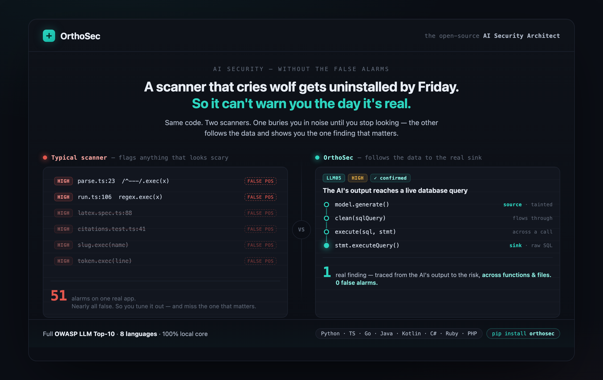
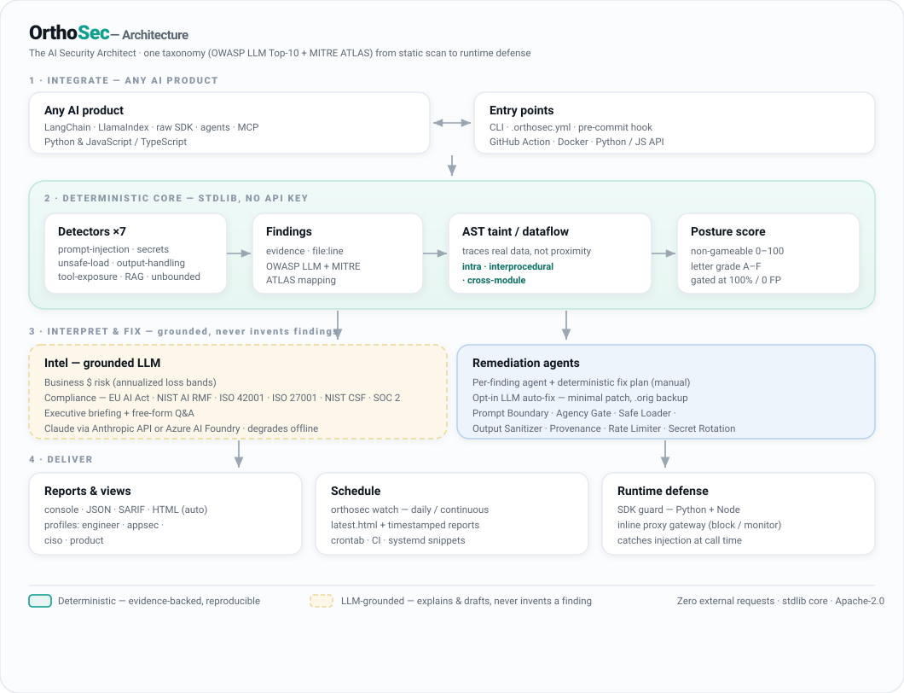

<h1 align="center">OrthoSec</h1>
<p align="center"><b>The AI Security Architect</b><br>
Technical AI-risk analysis with executive business context. Open source.</p>

<p align="center">
  <a href="https://pypi.org/project/orthosec/"></a>
  
  
  <a href="LICENSE"></a>
</p>
<!-- CI badge + live-demo link re-added once the org GitHub Actions billing lock is cleared:
  <a href="https://github.com/cloudivian-org/OrthoSec/actions/workflows/ci.yml"></a>
-->

<p align="center">
  
</p>
<p align="center"><sub><i>A typical scanner buries you in false alarms — OrthoSec follows the data to the one finding that's real.</i></sub></p>

---

OrthoSec scans any AI product and answers two questions at once:

- **For engineers** — *where is this AI system exposed, and how do I fix it?* Deterministic detectors map every finding to the OWASP LLM Top-10 and MITRE ATLAS, with `file:line` evidence and concrete remediation.
- **For executives** — *are we exposed, how bad is the blast radius, and what's the regulatory fallout?* A grounded intel layer translates findings into business risk, a posture score, and compliance mapping (EU AI Act, NIST AI RMF, ISO 42001, SOC 2).

One tool. Technical rigor **and** business impact.

## Why OrthoSec

AI products fail in AI-specific ways — prompt injection, excessive agency, model supply-chain compromise, data leakage — that classic AppSec tools don't see. OrthoSec is purpose-built for that surface, and it speaks to both the engineer shipping the agent and the leader accountable for the risk.

**Trust by design:** detectors are deterministic and evidence-backed. The LLM layer only *explains* findings — it never invents them. So the security facts are always defensible.

## Quick start

Zero dependencies. Install, or clone and run:

```bash
pip install orthosec                     # core (Python analysis + report), zero deps
# optional extras — intel layer, extra languages, prettier output:
pip install "orthosec[intel,ts,js,go,java,kotlin,csharp,ruby,php,rust,semgrep,pretty]"
orthosec scan ./path/to/your/ai-app

# from source (no install):
git clone https://github.com/cloudivian-org/OrthoSec && cd OrthoSec
python -m orthosec.cli scan ./path/to/your/ai-app
```

Try it on the bundled vulnerable demo:

```bash
python -m orthosec.cli scan examples/vulnerable-agent
```

### Scan a private or remote repo

`orthosec scan` accepts a **git URL or `owner/repo` shorthand** as well as a local path. It shallow-clones into a temp dir, scans it, and deletes the clone when it's done — nothing is left behind.

```bash
orthosec scan https://github.com/acme/ai-app.git      # public remote
orthosec scan acme/ai-app                              # GitHub shorthand
orthosec scan git@github.com:acme/private-ai.git       # private via your SSH key
```

For a **private** repo, pick whichever is safest for you — a credential never appears on the command line or in logs:

```bash
# 1. SSH (recommended) — uses your ssh-agent, no token to manage
orthosec scan git@github.com:acme/private-ai.git

# 2. Your existing git credential helper (gh / macOS keychain) — nothing to pass
orthosec scan https://github.com/acme/private-ai.git

# 3. A token piped over stdin — never stored, never logged, never in `ps`
printf '%s' "$MY_TOKEN" | orthosec scan https://github.com/acme/private-ai.git --git-token-stdin

# 4. A token from the environment (CI-friendly)
ORTHOSEC_GIT_TOKEN=$MY_TOKEN orthosec scan https://github.com/acme/private-ai.git
```

A token supplied via `--git-token-stdin` or `ORTHOSEC_GIT_TOKEN` / `GITHUB_TOKEN` is handed to git through `GIT_ASKPASS` and the child-process environment only — it's never placed in the clone URL, argv, or any log line. Add `--branch NAME` to pick a branch, or `--keep-clone` to keep the checkout. Default token username is `x-access-token` (works for GitHub PATs); override with `--git-username` for other providers.

```
  Posture score: 47/100   Grade:  D
  2 critical   2 high

  [CRITICAL] Model-invokable tool with shell/command execution and no confirmation gate
      agent.py:25
      OWASP LLM06 (Excessive Agency)  ·  ATLAS AML.T0053
      business: Agent takes real-world actions attacker directs — financial/operational loss.
      fix: Scope the tool to the minimum capability, add an allowlist, and gate
           irreversible/high-impact actions behind human confirmation.
```

## Audience profiles — one scan, four lenses

The same findings, reframed for whoever is reading. `--profile` controls what the report shows, the severity floor, and how the executive briefing is written.

```bash
python -m orthosec.cli scan ./my-ai-app --profile engineer   # default: every issue + fix
python -m orthosec.cli scan ./my-ai-app --profile appsec     # attack paths, ATLAS, CI gates
python -m orthosec.cli scan ./my-ai-app --profile ciso       # posture, $risk, compliance — no line noise
python -m orthosec.cli scan ./my-ai-app --profile product    # must-fix-before-ship vs. fast-follow
```

| Profile | Audience | Emphasis |
|---|---|---|
| `engineer` | AI/ML Engineer | Evidence + remediation on every finding |
| `appsec` | Security / AppSec Engineer | Attack path, MITRE ATLAS, what to gate in CI |
| `ciso` | CISO / Security Leader | Posture, dollar risk, regulatory exposure |
| `product` | AI Product / Eng Leader | Risk vs. ship velocity, quick wins |

`python -m orthosec.cli profiles` lists them.

## The executive layer

The core scan runs offline. Add the intel layer for board-ready narrative + free-form Q&A:

```bash
pip install -e ".[intel]"
cp .env.example .env      # then put your key in .env

python -m orthosec.cli scan ./my-ai-app --profile ciso
python -m orthosec.cli ask  ./my-ai-app "What's our EU AI Act exposure and what would fix it fastest?"
```

**Configuration (`.env`)** — copy `.env.example` to `.env`. Real environment variables always win over the file.

- **Local / self-hosted model** (highest precedence, 100% offline) — set `ORTHOSEC_LOCAL_MODEL_URL` to an OpenAI-compatible chat endpoint you run yourself. Great for a **security-specialized model like Foundation-Sec-8B** via Ollama — the briefing, `ask`, and `remediate --auto` all run on your machine, source never leaves. Needs no `anthropic` dependency.
  ```bash
  # Foundation-Sec-8B (or any security model) via Ollama's OpenAI-compatible API
  export ORTHOSEC_LOCAL_MODEL_URL=http://localhost:11434/v1/chat/completions
  export ORTHOSEC_LOCAL_MODEL=hf.co/fdtn-ai/Foundation-Sec-8B-Q4_K_M
  ```
- **Anthropic API** — set `ANTHROPIC_API_KEY`. Model defaults to `claude-opus-4-8` (`ORTHOSEC_MODEL` overrides).
- **Azure AI Foundry** (Claude via the Anthropic Messages API) — set `AZURE_API_KEY`, `AZURE_BASE_URL`, and `AZURE_MODELS` (e.g. `claude-sonnet-4-6`). OrthoSec auto-selects the Azure backend when these are present.

The intel layer is provider-agnostic and degrades to a deterministic briefing (posture, $risk, compliance) when no key is set — the core product never depends on it.

## Docker

```bash
docker build -t orthosec .
docker run --rm -v "$PWD:/scan" orthosec scan /scan --profile ciso
# with the exec layer:
docker run --rm --env-file .env -v "$PWD:/scan" orthosec scan /scan --profile ciso
```

## Visual report

```bash
python -m orthosec.cli scan ./my-ai-app --html report.html
```

**Every `orthosec scan` writes this report automatically** to `orthosec-report.html` (override with `--html PATH`, disable with `--no-report`). A self-contained, theme-aware HTML report (no external requests) with a **built-in profile toggle** — the same file switches between the engineer / appsec / ciso / product views live. The executive briefing renders as formatted HTML (headings, tables, lists), each finding shows its remediation agent, and selecting findings builds a ready-to-run `orthosec remediate` command. A stacked severity bar and an OWASP LLM Top-10 coverage strip summarize posture at a glance, each dataflow finding shows its **taint path** (`source → sink`) and a **confidence** level, and a Print / Save-as-PDF button exports it. Open it in a browser, attach it to a ticket, or drop it in a board deck.

<!-- Live sample report goes live once the GitHub Pages workflow can run (org Actions billing):
**[▶ View a live sample report →](https://cloudivian-org.github.io/OrthoSec/)** -->
Generate the report locally: `orthosec scan examples/vulnerable-agent` opens `orthosec-report.html`.

## Scheduling — continuous & daily reports

Run OrthoSec on a cadence. Defaults come from `.env` (or the flags override them):

```bash
orthosec watch ./my-ai-app --every 1d            # re-scan daily, write a report each run
orthosec watch ./my-ai-app --every 6h            # every 6h; latest.html always current
orthosec schedule ./my-ai-app --cron "0 9 * * *" # print crontab / GitHub Actions / systemd snippets
```

`watch` writes `report-<timestamp>.html` + `latest.html`/`latest.json` into `--report-dir` (default `orthosec-reports/`) on each run — a daily report if `--every 1d`, continuous if shorter. `.env` keys: `ORTHOSEC_WATCH_EVERY`, `ORTHOSEC_REPORT_DIR`, `ORTHOSEC_CRON`, `ORTHOSEC_PROFILE`. CLI flags always win over `.env`.

## Remediation agents

Every finding is routed to a specialized **remediation agent** that owns a deterministic, reviewable fix plan. Fixes are **manual by default** and **auto is opt-in**:

```bash
python -m orthosec.cli remediate ./my-ai-app                       # print plans (manual)
python -m orthosec.cli remediate ./my-ai-app --rule ORTHO-AGENCY-001 --suggest   # draft a patch, write nothing
python -m orthosec.cli remediate ./my-ai-app --rule ORTHO-SUPPLY-001 --auto      # apply the patch (.orig backup)
```

| Agent | Fixes | Auto? |
|---|---|---|
| Prompt Boundary | prompt-injection surface (LLM01) | ✅ |
| Agency Gate | over-privileged tools (LLM06) | ✅ |
| Safe Loader | unsafe deserialization (LLM03) | ✅ |
| Output Sanitizer | improper output handling (LLM05) | ✅ |
| Provenance | untrusted RAG ingestion (LLM08) | manual |
| Secret Rotation | committed credentials (LLM02) | manual |

**`--auto` runs a verify-gated cascade.** For each finding OrthoSec tries fix strategies **in order — and re-scans after every attempt**: a candidate is kept only if the re-scan confirms the finding is **resolved with no new HIGH/critical regression**; otherwise it's **reverted** and the next strategy runs. The strategies:

1. **Deterministic codemod** — for well-understood cases (`torch.load` → `weights_only=True`, `yaml.load` → `yaml.safe_load`): an LLM-free, reproducible, no-API-key edit.
2. **Local security model** — a patch drafted by a model you run yourself (Foundation-Sec-8B via `ORTHOSEC_LOCAL_MODEL_URL`), on your machine.
3. **Cloud model** — falls back to Anthropic / Azure if configured.

The **re-scan is the auto-catch**: a fix that doesn't actually verify is undone, not shipped. Set `ORTHOSEC_FIX_ORDER=model-first` to try the models ahead of the deterministic codemod (default `deterministic-first` is the most reproducible). The original is backed up to `*.orig` only when a fix is kept; `--no-verify` skips the re-scan. Rotation and source-trust decisions stay manual by design. **Design contract:** the deterministic layer decides **what** is wrong and the plan; models only draft the **patch**, every patch is re-scan-verified, and nothing invents a finding.

## Integrate with any AI product

OrthoSec matches behavioral patterns, not a specific framework — so it works on LangChain, LlamaIndex, raw provider SDKs, custom agents, or MCP tools alike. Full contract in **[INTEGRATION.md](INTEGRATION.md)**. Four implemented ways in:

1. **CLI** — `python -m orthosec.cli scan .`
2. **Project config** — drop [`.orthosec.yml`](.orthosec.example.yml) at your repo root (profile, `fail_on`, `exclude`).
3. **Pre-commit hook** *(no CI needed)* — gate every commit locally:
   ```yaml
   # .pre-commit-config.yaml
   - repo: https://github.com/cloudivian-org/OrthoSec
     rev: v0.5.0
     hooks: [{ id: orthosec }]
   ```
4. **Docker (any CI or local)** — `docker run --rm -v "$PWD:/scan" orthosec scan /scan --sarif /scan/orthosec.sarif --fail-on high`.
5. **GitHub Action** — [`.github/workflows/orthosec.yml`](.github/workflows/orthosec.yml); findings post inline on PRs via SARIF. *(Requires GitHub Actions enabled for the org.)*
6. **Python API / runtime guard** — `from orthosec import Scanner, guard`; Node via [`@orthosec/guard`](sdk/js).

```yaml
# .github/workflows/orthosec.yml
- uses: cloudivian-org/OrthoSec@main
  with: { profile: appsec, fail-on: high, sarif-file: orthosec.sarif }
- uses: github/codeql-action/upload-sarif@v3
  with: { sarif_file: orthosec.sarif }
```

Any other CI: `docker run --rm -v "$PWD:/scan" orthosec scan /scan --sarif /scan/orthosec.sarif --fail-on high`.

## What it detects today

| Detector | OWASP LLM | Catches |
|---|---|---|
| `prompt-hardening` | LLM01 / LLM07 | Untrusted input concatenated into prompts; secrets embedded in system prompts |
| `secrets` | LLM02 | Hardcoded provider/model API keys |
| `unsafe-model-load` | LLM03 / LLM04 | pickle / `torch.load` / unsafe deserialization; unpinned model fetches |
| `dependency-audit` | LLM03 | AI/ML deps in `requirements.txt` / `package.json` that are unpinned or installed from an untrusted source (git/URL/alt index) |
| `data-poisoning` | LLM04 | fine-tuning jobs; training on data from untrusted sources |
| `output-handling` | LLM05 | LLM output flowing unsanitized into eval/shell/SQL/HTML sinks |
| `tool-exposure` | LLM06 | Over-privileged agent tools (shell, file, HTTP, SQL) with no confirmation gate |
| `prompt-leakage` | LLM07 | System prompt written to logs / stdout |
| `rag-trust` | LLM08 | Untrusted web/upload content ingested into a retrieval corpus without provenance |
| `misinformation` | LLM09 | Ungrounded model output returned to users in a high-stakes domain (advisory) |
| `unbounded-consumption` | LLM10 | LLM calls with no output cap; unbounded agent loops (denial-of-wallet) |

**Full OWASP LLM Top-10 (2025) coverage** — all ten categories, 11 detectors, benchmark-gated at 100% precision/recall.

**Optional Semgrep engine (deterministic).** For general code-security coverage beyond the LLM dataflow surface — command injection, TLS bypass, auth mistakes, and anything in a Semgrep ruleset — enable the bundled [Semgrep](https://semgrep.dev) engine: `pip install "orthosec[semgrep]"` then `ORTHOSEC_SEMGREP=1 orthosec scan …`. Results map straight onto OrthoSec's findings, score, and report. It's **opt-in and deterministic** (no probabilistic false-positive risk), off by default, and adds zero cost when disabled. Point `ORTHOSEC_SEMGREP_CONFIG` at a larger ruleset (`p/security-audit`, a path, your own rules) to go broader than the bundled starter set.

Behavior detectors **ignore comments and negation** (a `# no confirmation` comment is never read as a mitigation) — false-negative avoidance is first-class.

**Dataflow, not line-proximity.** The three dataflow detectors — untrusted input → system prompt (LLM01), model output → dangerous sink (LLM05), and dangerous sink inside a model-invokable tool (LLM06) — fire only when the *actual* data reaches the *actual* sink. They trace it at any distance: **intra-function → interprocedural (across calls) → cross-module (import-resolved, including re-export chains)**, respecting trust-boundary and sanitizer mitigations. Tracking is **framework-aware** — it recognizes model output from LangChain / LlamaIndex / OpenAI / Anthropic call shapes (`chain.invoke`, `query_engine.query`, `chat.completions.create`, …) and untrusted input from Flask / FastAPI / Django request objects.

**Confidence tiers (optional).** Every finding carries a tier. By default it's
**`deterministic`** — the reproducible, trusted floor. With a model backend configured and
`ORTHOSEC_CONFIDENCE=1`, an opt-in pass asks the model to corroborate each finding against
its code and raises agreed ones to **`confirmed`** (shown with a reason), or attaches a
"possible false positive" note for a human to review. Crucially, this is **additive**: a
model can *confirm* or *comment*, but it never removes or downgrades a deterministic
finding and never invents one — the deterministic engine stays the arbiter, so you gain
model insight without losing the 0-FP guarantee. Fails open (model down → plain
deterministic results).

### Nine languages, same depth

Python uses the stdlib `ast`; every other language uses **tree-sitter** (JavaScript uses esprima), each an optional extra. Without a language's extra, its files fall back to regex automatically — no crash.

| Language | Install extra | Dataflow depth | Framework-aware of |
|---|---|---|---|
| **Python** | built-in | LLM01 · LLM05 · LLM06 · LLM10 — intra + interproc + **cross-module** | LangChain, LlamaIndex, OpenAI, Anthropic; Flask / FastAPI / Django requests |
| **TypeScript / JSX** | `orthosec[ts]` | LLM01 · LLM05 · LLM10 — intra + interproc + **cross-module** | OpenAI, Anthropic, LangChain.js |
| **JavaScript** | `orthosec[js]` | LLM05 · LLM10 (esprima) | OpenAI / Anthropic call shapes |
| **Go** | `orthosec[go]` | LLM01 · LLM05 · LLM10 — intra + interproc + **cross-module** | go-openai, langchaingo, anthropic-sdk-go |
| **Java** | `orthosec[java]` | LLM01 · LLM05 — intra + interproc + **cross-module** | Spring AI, LangChain4j |
| **Kotlin** | `orthosec[kotlin]` | LLM01 · LLM05 — intra + interproc + **cross-module** | JVM SDKs (Spring AI, LangChain4j); Android / Ktor |
| **C# / .NET** | `orthosec[csharp]` | LLM01 · LLM05 — intra + interproc + **cross-module** | Semantic Kernel, Azure OpenAI, OpenAI .NET |
| **Ruby** | `orthosec[ruby]` | LLM01 · LLM05 — intra + interproc + **cross-module** | ruby-openai, langchainrb |
| **PHP** | `orthosec[php]` | LLM01 · LLM05 — intra + interproc + **cross-module** | openai-php, LLPhant |
| **Rust** | `orthosec[rust]` | LLM01 · LLM05 — intra + interproc + **cross-module** | async-openai, rig, ollama-rs, genai |

Sinks recognized per language: model output into **shell/exec** (`os.system`, `exec.Command`, `Runtime.exec`, `Process.Start`, `Command::new`, `system`), **raw SQL** (`cursor.execute`, `db.Query`, `executeQuery`, `FromSqlRaw`, `$pdo->query`, `sqlx::query`, `whereRaw`), **eval**, and **HTML/XSS** (`innerHTML`, `dangerouslySetInnerHTML`, `Html.Raw`, `template.HTML`, `Html(…)`, `raw`/`echo`). Uncapped-completion (LLM10) is covered for Python, TypeScript/JS and Go.

Detectors are plugins — drop a file in `orthosec/detectors/`, decorate with `@register`, done. See [CONTRIBUTING.md](CONTRIBUTING.md).

## Runtime guard (SDK)

Static scanning finds risk before deploy; the runtime guard catches it at call time — in any Python AI app, any framework. Zero dependencies.

```python
from orthosec import guard, scan_prompt

@guard(mode="block", on_risk=lambda r: log.warning(r.risks))
def call_llm(prompt: str) -> str:
    ...  # your OpenAI / Anthropic / LangChain call

# or inspect directly
if not scan_prompt(user_input).ok:
    reject()
```

`mode="monitor"` reports via `on_risk` and never raises; `mode="block"` raises `PromptInjectionError` on an injection hit before the call. Output is scanned for credential leaks and executable payloads. A runtime tripwire — pair it with the static scanner and least-privilege tools.

**Optional local model backend (experimental).** The guard's prompt-injection check is deterministic regex by default. Point it at a **model you run yourself** — Meta Prompt Guard, Llama Guard via Ollama, or any OpenAI-compatible endpoint — to raise recall on novel injections. It's **opt-in, local-first, and fails open**: the model can only *add* a signal (never removes a regex hit, never becomes a static finding), and any timeout/error silently degrades to regex — a guarded call is never broken.

```bash
# e.g. Llama Guard running locally via Ollama
export ORTHOSEC_GUARD_MODEL_URL=http://localhost:11434/api/chat
export ORTHOSEC_GUARD_MODEL_KIND=ollama
export ORTHOSEC_GUARD_MODEL=llama-guard3
# or a Prompt Guard classifier server: KIND=classifier, URL=its /predict route
```

The **output side** works the same way, with its own independent backend
(`ORTHOSEC_OUTPUT_MODEL_URL`, …): point it at Llama Guard or a **PII / secret-leak
classifier** to catch sensitive data or unsafe content in *model output* before it
reaches a user or a downstream sink. Same guarantees — additive, fail-open, deterministic
regex always runs underneath.

Deterministic detectors and the static scan are unaffected — this only enriches the runtime `scan_prompt` / `scan_output` / `@guard` / `proxy` path. See the env table below for all `ORTHOSEC_GUARD_MODEL_*` / `ORTHOSEC_OUTPUT_MODEL_*` options.

**Node / TypeScript** apps get the same guard via [`@orthosec/guard`](sdk/js) (zero deps):

```js
import { guard, scanPrompt } from "@orthosec/guard";
const chat = guard(async (prompt) => client.chat.completions.create(/* ... */),
                   { mode: "block", onRisk: (r) => log.warn(r.risks) });
```

## Runtime gateway (inline proxy)

For defense without touching app code, run OrthoSec as a proxy in front of the model provider and point your base URL at it:

```bash
orthosec proxy --upstream https://api.openai.com --mode block
# then: export OPENAI_BASE_URL=http://127.0.0.1:8100/v1
```

Every request/response flows through inline: injected prompts are refused (`block`) or logged (`monitor`) before reaching the provider, and responses are scanned for credential leaks / executable payloads. Provider-agnostic (OpenAI + Anthropic message shapes), stdlib-only, adds `X-OrthoSec-*-Risk` headers and a JSON audit log.

## Adopt on an existing codebase (baseline + ignore)

Turning `--fail-on` on a repo that already has findings would flood CI. Baseline it once, then gate on **new** findings only:

```bash
orthosec scan . --write-baseline .orthosec-baseline.json   # accept today's findings
orthosec scan . --baseline .orthosec-baseline.json --fail-on high  # CI fails only on NEW ones
```

For a fast pre-commit / PR gate, scan only what changed:

```bash
orthosec scan . --diff              # only files changed vs HEAD (untracked + modified)
orthosec scan . --diff origin/main  # only files changed vs a branch
```

The baseline matches by a **stable fingerprint** (rule + file + evidence, not line number), so shifting code doesn't resurface a finding. For one-off exceptions, an inline comment on the finding's line (or the line above) suppresses it:

```python
return pickle.load(f)          # orthosec: ignore            (suppress any finding here)
return pickle.load(f)          # orthosec: ignore LLM03      (only this category)
```

## CLI & configuration reference

Every command supports `--help` — run `orthosec <command> --help` for its full flag list.

| Command | What it does | Key options |
|---|---|---|
| `scan <path \| git-url \| owner/repo>` | Scan a local path, or clone & scan a remote/private repo | `--profile`, `--html/--json/--sarif FILE`, `--no-report`, `--no-exec`, `--fail-on {critical,high,medium,low,none}`, `--diff [REF]`, `--baseline/--write-baseline FILE`, `--open`; **remote:** `--branch`, `--git-token-stdin`, `--git-username`, `--keep-clone` |
| `ask <path> "<question>"` | Grounded executive Q&A about a scan *(needs an LLM key)* | `--profile` |
| `remediate <path>` | Plan or apply fixes via remediation agents | `--rule`, `--agent`, `--suggest`, `--auto`, `--no-verify` |
| `watch <path>` | Re-scan on a schedule, writing a report each run | `--every`, `--report-dir`, `--profile`, `--no-exec` |
| `schedule <path>` | Print crontab / GitHub Actions / systemd snippets | `--cron`, `--profile` |
| `proxy` | Inline runtime gateway in front of a model provider | `--upstream`, `--host`, `--port`, `--mode {monitor,block}` |
| `detectors` | List the active detectors | — |
| `profiles` | List the audience profiles | — |

**Ways to run OrthoSec:** static `scan` (CLI / Docker / CI) · scheduled `watch` · runtime `guard` SDK (Python + Node) · inline `proxy` gateway. Same taxonomy and report across all four.

**Configuration & environment variables** — put any of these in a `.env` (copy `.env.example`); real environment variables always win over the file. CLI flags win over both.

| Variable | Scope | Effect |
|---|---|---|
| `ANTHROPIC_API_KEY` | intel / report / `ask` | Enable the executive briefing + Q&A via Anthropic. Model = `ORTHOSEC_MODEL` (default `claude-opus-4-8`) |
| `AZURE_API_KEY` + `AZURE_BASE_URL` + `AZURE_MODELS` | intel | Use Azure AI Foundry (Claude via the Anthropic Messages API) — auto-selected when set |
| `ORTHOSEC_LOCAL_MODEL_URL` | intel / remediation | Use a **local** OpenAI-compatible model (e.g. Foundation-Sec-8B via Ollama) for briefing / `ask` / `remediate --auto` — highest precedence, offline. With `ORTHOSEC_LOCAL_MODEL` · `ORTHOSEC_LOCAL_API_KEY` · `ORTHOSEC_LOCAL_TIMEOUT` |
| `ORTHOSEC_FIX_ORDER` | remediate | `deterministic-first` (default) or `model-first` — order of the verify-gated auto-fix cascade (deterministic codemod · local model · cloud model) |
| `ORTHOSEC_CONFIDENCE` · `ORTHOSEC_CONFIDENCE_MAX` | scan | `1` enables model corroboration of findings → confidence tiers (`confirmed`/`deterministic`); max findings to corroborate (default 40). Needs a model backend |
| `ORTHOSEC_MODEL` | intel | Override the model id |
| `ORTHOSEC_NO_EXEC` | scan / watch | `1` disables the intel layer (equivalent to `--no-exec`) |
| `ORTHOSEC_REPORT` | scan | Report path, or `off`/`none`/`0` to disable the auto-report |
| `ORTHOSEC_OPEN` | scan | `1` opens the report in a browser after the scan |
| `ORTHOSEC_PROFILE` | all | Default audience profile (`engineer`/`appsec`/`ciso`/`product`) |
| `ORTHOSEC_FAIL_ON` | scan | Default severity gate for a non-zero exit |
| `ORTHOSEC_WATCH_EVERY` · `ORTHOSEC_REPORT_DIR` · `ORTHOSEC_CRON` | watch / schedule | Scheduling defaults |
| `ORTHOSEC_UPSTREAM` | proxy | Provider base URL for the inline gateway |
| `ORTHOSEC_SEMGREP` · `ORTHOSEC_SEMGREP_CONFIG` | scan | `1` enables the optional Semgrep engine; config points at a ruleset (default: bundled starter rules). Needs `orthosec[semgrep]` |
| `ORTHOSEC_GUARD_MODEL_URL` | guard / proxy | Enable the optional local model-backed injection check (endpoint to POST to) |
| `ORTHOSEC_GUARD_MODEL_KIND` · `ORTHOSEC_GUARD_MODEL` | guard | Endpoint shape (`classifier`/`ollama`/`openai`) + model name |
| `ORTHOSEC_GUARD_THRESHOLD` · `ORTHOSEC_GUARD_TIMEOUT` · `ORTHOSEC_GUARD_API_KEY` | guard | Score threshold (0.5), per-call timeout (4s), optional bearer token |
| `ORTHOSEC_OUTPUT_MODEL_URL` (+ `_KIND`/`_MODEL`/`_THRESHOLD`/`_TIMEOUT`/`_API_KEY`) | guard | Output-side model backend — PII / secret-leak / safety check on model output (same shapes as the input guard, independent config) |
| `ORTHOSEC_GIT_TOKEN` · `GITHUB_TOKEN` · `GH_TOKEN` · `GITLAB_TOKEN` | scan | Token for cloning a **private** repo (never logged; see `--git-token-stdin`) |

> The deterministic core needs no keys and no network — an LLM key only unlocks the executive narrative + `ask`. Without one, the report still renders posture, `$`-risk, and compliance from the deterministic findings.

## Detection efficacy

Accuracy is measured, not asserted. A labeled corpus of vulnerable samples **and safe look-alikes** (mitigated code that resembles a vulnerability) drives a precision/recall benchmark — run `python benchmark/run.py`:

| | Precision | Recall | F1 |
|---|---|---|---|
| All 11 detectors, 46 cases | 100% | 100% | 100% |

Zero false positives on the safe look-alikes is the headline number — a scanner that cries wolf gets uninstalled. `tests/test_benchmark.py` enforces this as a **regression gate** (precision/recall ≥ 95%, FP = 0), so detection quality can't silently degrade. Methodology and honest limitations (obfuscation, cross-file dataflow, non-Python langs) are in [benchmark/README.md](benchmark/README.md). Adversarial cases welcome.

## Data handling & privacy

You are scanning your own source code, so egress matters. OrthoSec is offline by default:

- **Deterministic core — 100% local.** Detectors, taint analysis, the posture score, and the HTML report run entirely on your machine. No network calls, no telemetry, nothing sent anywhere. The report is self-contained (no external requests when you open it).
- **Intel layer — opt-in, findings metadata only.** The executive briefing is the *only* feature that calls an LLM. When enabled, it sends **finding metadata** (rule, OWASP/ATLAS category, severity, `file:line`, short evidence) to *your* configured provider — Anthropic or your own Azure AI Foundry endpoint, using *your* API key from `.env`. It does not upload your files or repository.
- **Fully offline:** `orthosec scan --no-exec` disables the intel layer completely — zero provider calls.
- **No account, no phone-home.** OrthoSec never contacts an OrthoSec-operated server.

## Known limitations

Static analysis is honest about what it can and can't see:

- **Language depth: Python leads by one detector.** All eight tree-sitter languages (TypeScript/JS, Go, Java, Kotlin, C#, Ruby, PHP, Rust) now have full intra + interprocedural + **cross-module** taint for **LLM01 and LLM05**. Tool-exposure dataflow (LLM06) and uncapped-completion (LLM10) across the JVM / C# / Ruby / PHP / Rust analyzers remain Python-first. Without a language's extra, its files fall back to the regex path.
- **Run OrthoSec on a Python ≥ the target's syntax for full precision.** The Python detectors AST-parse target code; if the scanner runs on an *older* Python than the code it scans (e.g. 3.9 scanning a repo that uses 3.10+ `match`/syntax), that file can't be AST-parsed and falls back to the less-precise regex path (more findings to triage). Install OrthoSec on Python 3.11+ to scan modern codebases at full AST precision.
- **Detectors reason about code, not runtime.** Tainted data reaching a sink through a database, queue, or network round-trip that OrthoSec can't follow may be missed.
- **The intel layer explains, it never invents.** The business/compliance narrative is grounded in the deterministic findings; with `--no-exec` you lose the narrative, never a finding.

Found a false positive or a miss? That's the most valuable issue you can file — see [benchmark/README.md](benchmark/README.md).

## Roadmap

- **Shipped**
  - **Full OWASP LLM Top-10 (2025) coverage** — 11 detectors, benchmark-gated at 100% precision/recall (incl. AI-dependency supply-chain audit of `requirements.txt` / `package.json`).
  - **Nine-language AST taint depth** — Python, TypeScript/JS, Go, Java, Kotlin, C#, Ruby, PHP, Rust all have intra-function + **interprocedural** + **cross-module** tracking for **LLM01 + LLM05** (Python adds LLM06/LLM10), framework-aware, tree-sitter-based (JS = esprima).
  - **Scan remote & private repos** — `orthosec scan <git-url | owner/repo>` clones and scans; private repos authenticate via ssh-agent, your git credential helper, or a token from stdin / env (never in argv or logs).
  - **Precision-hardened** — validated FP-free across 20 public AI repos (LibreChat, crewAI, langchain4j, BotSharp, instructor-php, …); real true-positives preserved.
  - **Delivery** — four audience profiles; provider-agnostic intel (Anthropic + Azure Foundry); self-contained HTML report + remediation agents; runtime guard (`@guard`, Python + Node) and inline `orthosec proxy`; scheduling; baseline + inline suppression; `--diff` PR scanning; SARIF with stable fingerprints; PR-native GitHub Action. On PyPI (`pip install orthosec`) and npm (`@orthosec/guard`).
- **Next** — GitHub Marketplace listing; PDF report export; deeper per-language framework coverage; LLM06/LLM10 parity on the tree-sitter languages.
- **Later** — managed dashboard; more compliance packs; org-wide baselines.

### Language coverage roadmap

AI products aren't only Python. OrthoSec's AST layer is built on **tree-sitter**, which
has maintained grammars for every major language — so each new language is the same
pattern (parse → taint the OWASP-LLM dataflows → reuse the detectors), added step by step
in order of how widely it's used to *build AI products*:

| # | Language | AI-product usage | Status |
|---|----------|------------------|--------|
| 1 | **Python** | The default for AI/ML, agents, RAG, training | ✅ Full — LLM01/05/06/10, intra + interproc + cross-module, all 11 detectors |
| 2 | **TypeScript / JavaScript / JSX** | AI web apps, agent UIs, Node backends, SDKs | ✅ LLM01 · LLM05 · LLM10, intra + interproc + cross-module (`orthosec[ts]`; `[js]` = esprima) |
| 3 | **Go** | High-throughput inference gateways, agent backends, infra | ✅ LLM01 · LLM05 · LLM10, intra + interproc + cross-module (`orthosec[go]`); go-openai / langchaingo / anthropic-sdk-go |
| 4 | **Java + Kotlin** | Enterprise AI services, Android AI apps | ✅ LLM01 · LLM05, intra + interproc + cross-module (`orthosec[java]` / `[kotlin]`); Spring AI / LangChain4j |
| 5 | **C# / .NET** | Enterprise AI, Semantic Kernel, Azure-native apps | ✅ LLM01 · LLM05, intra + interproc + cross-module (`orthosec[csharp]`); Semantic Kernel / Azure OpenAI / OpenAI .NET |
| 6 | **Ruby + PHP** | AI features in Rails / Laravel product code | ✅ LLM01 · LLM05, intra + interproc + cross-module (`orthosec[ruby]` / `[php]`); ruby-openai / langchainrb / openai-php / LLPhant |
| 7 | **Rust** | Inference engines, performance-critical AI infra | ✅ LLM01 · LLM05, intra + interproc + cross-module (`orthosec[rust]`); async-openai / rig / ollama-rs / genai |

Every language maps to the **same OWASP LLM Top-10 taxonomy and detectors** — the report,
severity model, compliance mapping, and remediation agents are language-agnostic, so
adding a language extends coverage without fragmenting the product.

## Architecture

<p align="center">
  
</p>

## Status

**0.9.x — full OWASP LLM Top-10 coverage across 8 languages, precision-hardened on real-world repos.** Deterministic core is stable and offline-by-default; the intel layer is opt-in. Pre-1.0 and building toward product-market fit — feedback, issues, and detector contributions are the whole point right now.

- [Open an issue](https://github.com/cloudivian-org/OrthoSec/issues) — false positives and misses are the most valuable reports.
- [SECURITY.md](SECURITY.md) — report a vulnerability privately.
- [CONTRIBUTING.md](CONTRIBUTING.md) — add a detector or a language.

## License

Apache-2.0.
